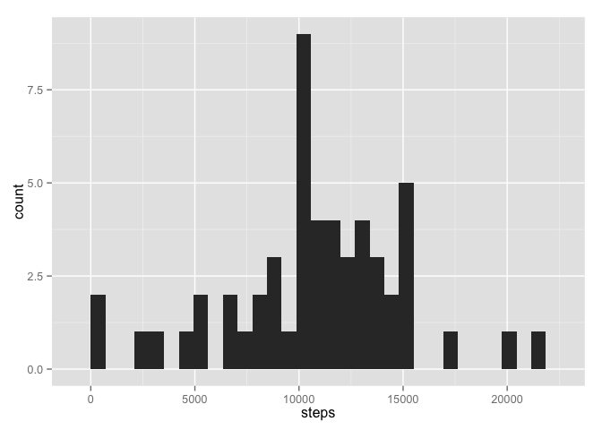
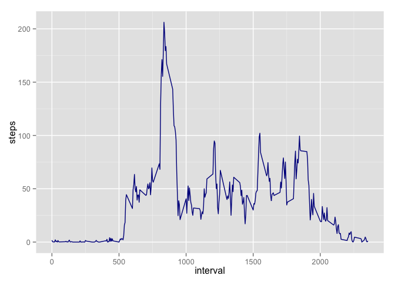
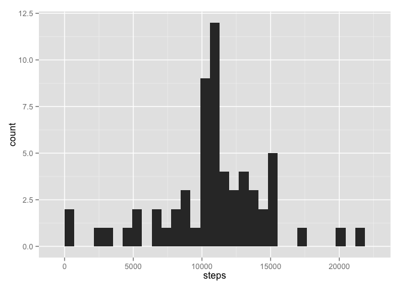
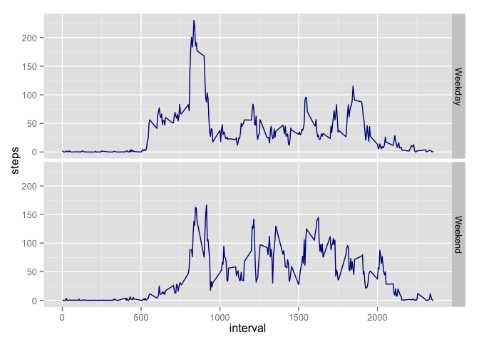

# Reproducible Research: Peer Assessment 1


## Loading and preprocessing the data
First, read the data into RStudio

```r
require(reshape2)
```

```
## Loading required package: reshape2
```

```r
require(ggplot2)
```

```
## Loading required package: ggplot2
```

```
## Warning: package 'ggplot2' was built under R version 3.1.3
```

```r
require(dplyr)
```

```
## Loading required package: dplyr
## 
## Attaching package: 'dplyr'
## 
## The following object is masked from 'package:stats':
## 
##     filter
## 
## The following objects are masked from 'package:base':
## 
##     intersect, setdiff, setequal, union
```

```r
df <- read.csv("activity.csv")
```

Create data set with daily sum of daily step count

```r
dfsub <- subset(df, select = steps:date)
dailysteps <- aggregate(steps~date, dfsub, sum)
```

## What is mean total number of steps taken per day?

First, calculate and plot a histogram of the total steps per day.

```r
m <- ggplot(dailysteps, aes(x=steps))
m + geom_histogram()
```

 

Then mean steps per day,

```r
dailymean <- mean(dailysteps$steps)
dailymean
```

```
## [1] 10766.19
```

and median steps per day

```r
dailymedian <- median(dailysteps$steps)
dailymedian
```

```
## [1] 10765
```
## What is the average daily activity pattern?
Creating a new data set for mean steps per time interval and plotting the data

```r
dfsubinterval <- subset(df, select = c(steps, interval))
intervalsteps <- aggregate(steps~interval, dfsubinterval, mean)

p <- ggplot(intervalsteps, aes(x = interval, y = steps))
p + geom_line(color = "dark blue")
```

 

The interval with the highest mean step count is:

```r
intervalsteps$interval[which(intervalsteps$steps == max(intervalsteps$steps))]
```

```
## [1] 835
```

## Imputing missing values
Although we've calculated many interesting values, the missing step values can through off our calculations. To calculate the number of missing values we can use: 

```r
sum(is.na(df$steps))
```

```
## [1] 2304
```

With that level of missing values, we should check for sensitivity of our previous calculations to imputed values for these missing variables.

To impute values for the missing data we'll replace the missing values with the average for that time interval as an approximation of the typical step behavior of the individual during that time of the day.

To do that we'll merge the data of the interval steps means with the overall dataset and then search for and replace the NA values with the interval mean values.


```r
colnames(intervalsteps) <- c("interval", "intmeansteps")
imputed <- merge(df, intervalsteps, "interval")
imputed <- mutate(imputed, steps = ifelse(is.na(steps), intmeansteps, steps))
```

Now we'll create the same histogram of daily step sum and the mean and median steps per day for comparison. First the histogram. 


```r
imputedsub <- subset(imputed, select = steps:date)
impdailysteps <- aggregate(steps~date, imputed, sum)
n <- ggplot(impdailysteps, aes(x=steps))
n + geom_histogram()
```

 

Next the mean with the imputed values:

```r
impdailymean <- mean(impdailysteps$steps)
impdailymean
```

```
## [1] 10766.19
```

And finally, the median of the daily step count with the imputed values:


```r
impdailymedian <- median(impdailysteps$steps)
impdailymedian
```

```
## [1] 10766.19
```

To analyze the impact of the imputed variables we can first look at the histograms. There are slight variations in the histograms. The hight of the bars have decreased and there has been a shift to the right as some of the daily step estimates are now higher due including the imputed steps. Next, we'll look at the change in the sum of the number of total steps, the mean, and the median.

The change in the total step count is:

```r
sum(df$steps, rm.na = TRUE) - sum(imputed$steps)
```

```
## [1] NA
```
The original data is that number smaller than the imputed data set.

The mean has changed by:

```r
dailymean - impdailymean
```

```
## [1] 0
```

The median has changed by:

```r
dailymedian - impdailymedian
```

```
## [1] -1.188679
```

The mean is the same and the median is very similar, even with the increase in the total step count. This is not surprising since the imputed variables, in effect, are just adding more of the average value to be included in a new average calculation. 

## Are there differences in activity patterns between weekdays and weekends?

It is natural to suppose that the step behavior between weekdays and weekends of many individuals would vary signficantly. We'll next turn to evaluating if that is the case for our test subject. 

To do that we need to first edit our data set with the imputed values to determine weekdays and weekends.


```r
imputed$date <- as.Date(imputed$date)
imputed <- mutate(imputed, day = weekdays(date))
imputed <- mutate(imputed, partofweek = ifelse(day == "Saturday", "Weekend", ifelse(day == "Sunday", "Weekend", "Weekday")))
imputed$partofweek <- as.factor(imputed$partofweek)
```

Now that we have a data set with the factor for part of week we need to aggregate the data to be able to plot it. 


```r
imputedsub <- subset(imputed, select = c(steps, interval, partofweek))
imputedagg <- aggregate(steps~partofweek + interval, imputedsub, mean)
```

With the data aggregated we can plot the mean steps per interval by part of week.

```r
q <- ggplot(imputedagg, aes(x = interval, y = steps))
q + geom_line(color = "dark blue") + facet_grid(partofweek~.)
```

 

We'll finish by detaching the libraries:

```r
detach(package:ggplot2, unload = TRUE)
detach(package:dplyr, unload = TRUE)
```
